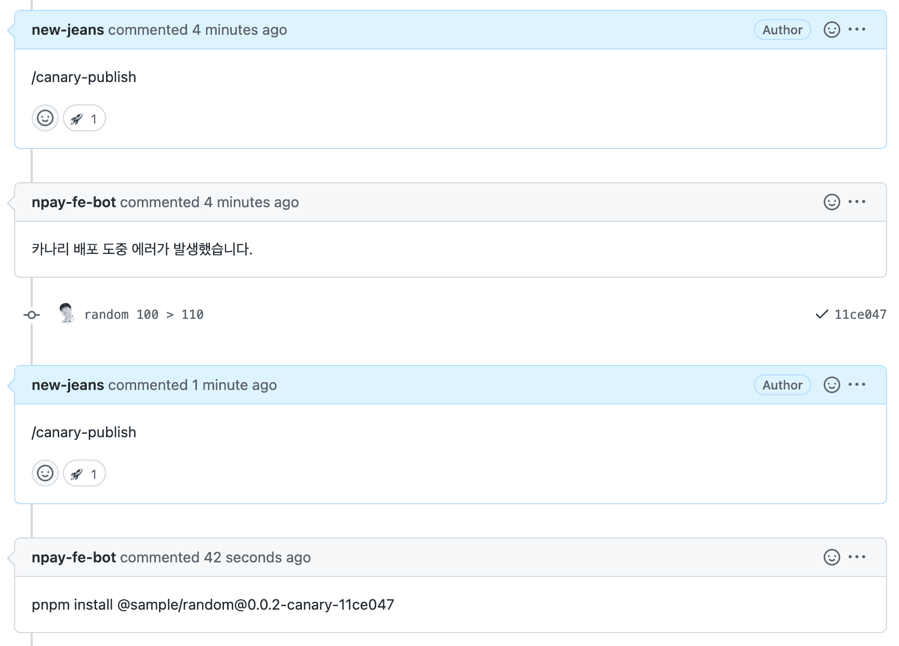
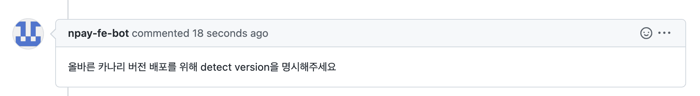
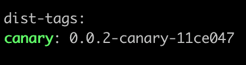

# changesets-canary-publish

## 설명

- changeset을 이용한 패키지 배포 플로우를 사용할 때, 해당 PR의 변경점을 파악하여 `.changeset` 하위 변경된 패키지들을 Canary 배포할 수 action 입니다.

## 사용 방법

- 프로젝트 root의 `.github/workflows` 경로에 아래와 같이 `.yaml` 파일을 작성합니다.

```yaml
# 기호에 맞게 변경해주세요
name: changeset canary publish

on:
    issue_comment:
        types:
            - created

concurrency: ${{ github.workflow }}-${{ github.ref }}

jobs:
    canary:
        if: ${{ github.event.issue.pull_request && (github.event.comment.body == 'canary-publish' || github.event.comment.body == '/canary-publish')}}
        runs-on: ubuntu-latest
        steps:
            - name: Get PR branch name
              id: get_branch
              run: |
                PR=$(curl -H "Authorization: token ${{ secrets.GITHUB_TOKEN }}" ${{ github.event.issue.pull_request.url }})
                echo "::set-output name=branch::$(echo $PR | jq -r '.head.ref')"

            - name: Checkout Repo
              uses: actions/checkout@v3
              with:
                ref: ${{ steps.get_branch.outputs.branch }}

            - name: Install Dependencies
              run: pnpm install --frozen-lockfile

            - name: Canary Publish
              uses: NaverPayDev/changeset-actions/canary-publish@main
              with:
                  github_token: ${{ secrets.GITHUB_TOKEN }} # 필요하면 user의 PAT을 넣어주세요.
                  npm_tag: canary # npm 배포 시 달아줄 태그는 무엇으로 할지적어주세요
                  npm_token: ${{ secrets.NPM_TOKEN }} # npm 배포시 필요한 publish token 을 넣어주세요 
                  publish_script: pnpm run deploy:canary # canary 배포 실행 script 를 넣어주세요
                  packages_dir: packages # 변경을 탐지할 패키지들의 폴더명을 추가해주세요. (default: packages,share)       
                  excludes: ".turbo,.github" # 변경감지를 제외하고싶은 파일 또는 폴더 경로      
```

## 실행 결과




