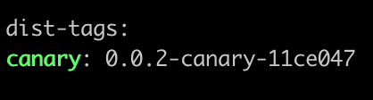

# changesets-canary-publish

## Description

This action allows Canary deployment of modified packages under the `.changeset` directory when using a package deployment flow based on changesets. It identifies changes in the pull request and deploys the updated packages.

## Usage

Create a `.yaml` file in the `.github/workflows` directory at the root of your project as shown below:

```yaml
# Adjust according to your needs
name: changeset canary publish

on:
    issue_comment:
        types:
            - created

concurrency: ${{ github.workflow }}-${{ github.ref }}

jobs:
    canary:
        if: ${{ github.event.issue.pull_request && (github.event.comment.body == 'canary-publish' || github.event.comment.body == '/canary-publish')}}
        runs-on: ubuntu-latest
        steps:
            - name: Get PR branch name
              id: get_branch
              run: |
                PR=$(curl -H "Authorization: token ${{ secrets.GITHUB_TOKEN }}" ${{ github.event.issue.pull_request.url }})
                echo "::set-output name=branch::$(echo $PR | jq -r '.head.ref')"

            - name: Checkout Repo
              uses: actions/checkout@v3
              with:
                ref: ${{ steps.get_branch.outputs.branch }}

            - name: Install Dependencies
              run: pnpm install --frozen-lockfile

            - name: Canary Publish
              uses: NaverPayDev/changeset-actions/canary-publish@main
              with:
                  github_token: ${{ secrets.GITHUB_TOKEN }}           # (Required) GitHub API token for authentication. Use a user PAT if necessary.
                  npm_tag: canary                                    # (Optional) The npm tag to use for deployment (e.g., canary, beta).
                  npm_token: ${{ secrets.NPM_TOKEN }}                # (Required) Token used for npm publishing.
                  publish_script: pnpm run deploy:canary             # (Required) Script command to execute the canary deployment.
                  packages_dir: packages                             # (Optional) Directory containing packages to check for changes (default: packages,share).
                  excludes: ".turbo,.github"                         # (Optional) Files or directories to exclude from change detection (comma-separated).
                  version_template: '{VERSION}-canary.{DATE}-{COMMITID7}' # (Optional) Template for the canary version string.
                  dry_run: false                                     # (Optional) If true, performs a dry run without publishing.
                  language: 'en'                                     # (Optional) Language for output messages (e.g., en, ko).
                  create_release: false                              # (Optional) If true, creates a GitHub Release after canary publishing. Make sure to add `fetch-depth: 0` `with` option to @action/checkout.
```

## Execution Results



