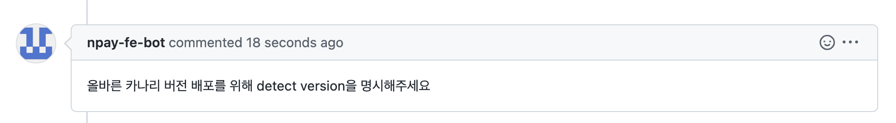

# changesets-canary-publish

## Description

This action allows Canary deployment of modified packages under the `.changeset` directory when using a package deployment flow based on changesets. It identifies changes in the pull request and deploys the updated packages.

## Usage

Create a `.yaml` file in the `.github/workflows` directory at the root of your project as shown below:

```yaml
# Adjust according to your needs
name: changeset canary publish

on:
    issue_comment:
        types:
            - created

concurrency: ${{ github.workflow }}-${{ github.ref }}

jobs:
    canary:
        if: ${{ github.event.issue.pull_request && (github.event.comment.body == 'canary-publish' || github.event.comment.body == '/canary-publish')}}
        runs-on: ubuntu-latest
        steps:
            - name: Get PR branch name
              id: get_branch
              run: |
                PR=$(curl -H "Authorization: token ${{ secrets.GITHUB_TOKEN }}" ${{ github.event.issue.pull_request.url }})
                echo "::set-output name=branch::$(echo $PR | jq -r '.head.ref')"

            - name: Checkout Repo
              uses: actions/checkout@v3
              with:
                ref: ${{ steps.get_branch.outputs.branch }}

            - name: Install Dependencies
              run: pnpm install --frozen-lockfile

            - name: Canary Publish
              uses: NaverPayDev/changeset-actions/canary-publish@main
              with:
                  github_token: ${{ secrets.GITHUB_TOKEN }}           # (Required) GitHub API token for authentication. Use a user PAT if necessary.
                  npm_tag: canary                                    # (Optional) The npm tag to use for deployment (e.g., canary, beta).
                  publish_script: pnpm run deploy:canary             # (Required) Script command to execute the canary deployment.
                  packages_dir: packages                             # (Optional) Directory containing packages to check for changes (default: packages,share).
                  excludes: ".turbo,.github"                         # (Optional) Files or directories to exclude from change detection (comma-separated).
                  version_template: '{VERSION}-canary.{DATE}-{COMMITID7}' # (Optional) Template for the canary version string.
                  dry_run: false                                     # (Optional) If true, performs a dry run without publishing.
                  language: 'en'                                     # (Optional) Language for output messages (e.g., en, ko).
                  create_release: false                              # (Optional) If true, creates a GitHub Release after canary publishing.
                  provenance: true                                   # (Optional) Enable provenance statements (requires npm CLI 11.5.1+)
```

### ⚠️ Important Notes for `create_release: true`

When using this action with `create_release: true`, please make sure to:

1. Set `fetch-depth: 0` for `actions/checkout`

    This ensures the full git history is available for generating release notes.

    ```yml
    - uses: actions/checkout@v4
      with:
          fetch-depth: 0
    ```

2. Set the `GH_TOKEN` environment variable

    The gh CLI requires authentication. Set the token as an environment variable:

    ```yml
    env:
        GH_TOKEN: ${{ github.token }}
    ```

    Or at the job/workflow level.

3. Add `permissions: contents: write` to your workflow

    This is required for creating releases via the GitHub API.

    ```yml
    permissions:
        contents: write
    ```

Example Workflow Snippet

```yml
permissions:
  contents: write

jobs:
  release:
    env:
      GH_TOKEN: ${{ github.token }}
    steps:
      - uses: actions/checkout@v4
        with:
          fetch-depth: 0
      - uses: NaverPayDev/changeset-actions/canary-publish@main
        with:
          create_release: true
```

**If any of these are missing, the release creation step may fail.**

## NPM OIDC Trusted Publishing

This action uses NPM's OIDC-based trusted publishing, which eliminates the need for storing NPM tokens as secrets. This provides better security by using short-lived, workflow-specific credentials.

### Prerequisites

1. **NPM CLI Version**: Requires npm CLI v11.5.1 or later
2. **GitHub Actions Runner**: Must use GitHub-hosted runners
3. **NPM Package Configuration**: Configure trusted publishers on npmjs.com

### Setup Steps

1. **Configure Trusted Publisher on npmjs.com**:
   - Go to your package settings on npmjs.com
   - Navigate to "Publishing access" → "Trusted publishers"
   - Add a new trusted publisher with:
     - Organization/User: Your GitHub organization or username
     - Repository: Your repository name
     - Workflow filename: Your workflow file name (e.g., `canary-publish.yml`)
     - Environment name: (Optional) If using GitHub environments

2. **Update your workflow**:
   - Add `id-token: write` permission
   - Remove `npm_token` input (or leave it empty)
   - Ensure npm CLI version is 11.5.1+

Example workflow with OIDC:

```yaml
name: changeset canary publish

on:
    issue_comment:
        types:
            - created

permissions:
    id-token: write      # Required for OIDC
    contents: write      # Required for creating releases
    pull-requests: write # Required for PR comments

jobs:
    canary:
        if: ${{ github.event.issue.pull_request && (github.event.comment.body == 'canary-publish' || github.event.comment.body == '/canary-publish')}}
        runs-on: ubuntu-latest
        steps:
            - name: Get PR branch name
              id: get_branch
              run: |
                PR=$(curl -H "Authorization: token ${{ secrets.GITHUB_TOKEN }}" ${{ github.event.issue.pull_request.url }})
                echo "::set-output name=branch::$(echo $PR | jq -r '.head.ref')"

            - name: Checkout Repo
              uses: actions/checkout@v3
              with:
                ref: ${{ steps.get_branch.outputs.branch }}

            - name: Setup Node with latest npm
              uses: actions/setup-node@v4
              with:
                node-version: '20'
                registry-url: 'https://registry.npmjs.org'

            - name: Install Dependencies
              run: pnpm install --frozen-lockfile

            - name: Canary Publish
              uses: NaverPayDev/changeset-actions/canary-publish@main
              with:
                  github_token: ${{ secrets.GITHUB_TOKEN }}
                  npm_tag: canary
                  publish_script: pnpm run deploy:canary
                  packages_dir: packages
                  provenance: true
```

### Benefits of OIDC

- No need to create, store, or rotate NPM tokens
- Automatic provenance attestations
- Reduced risk of token exfiltration
- Better audit trail

## Execution Results




