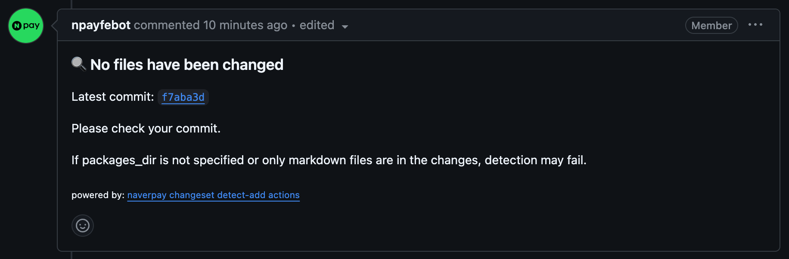
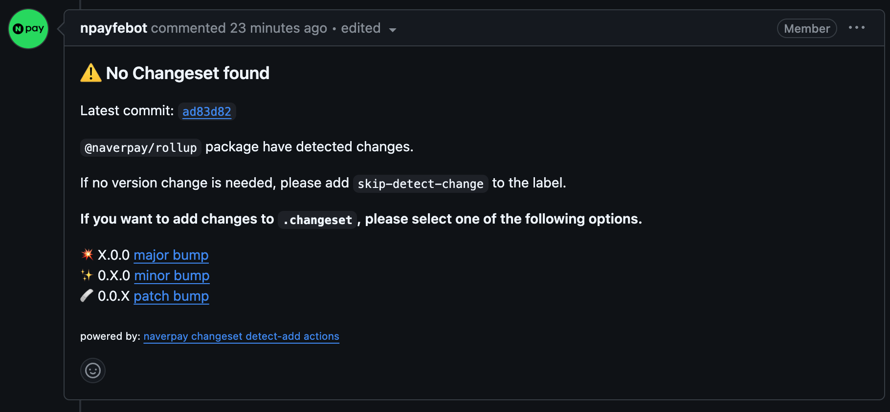
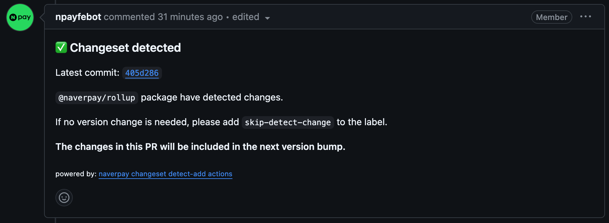

# changesets-detect-add

## Description

- This action is designed to work with the changeset-based package release flow. It detects changes in the current PR and guides you to document the changes in a file under `.changeset`.

## How to Use

- Create a `.yaml` file under the `.github/workflows` directory in the root of your project as shown below:

```yaml
# Adjust according to your preferences
name: changeset-detect-add
on:
    pull_request:
        branches:
            - '**'
        types: [opened, reopened, labeled, unlabeled, synchronize]

jobs:
    detectAdd:
        runs-on: ubuntu-latest
        steps:
            - uses: actions/checkout@v3
              with:
                  ref: ${{ github.head_ref }}
            - uses: NaverPayDev/changeset-actions/actions/detect-add@main
              with:
                  github_token: ${{ secrets.GITHUB_TOKEN }} # If needed, use the user's PAT.
                  skip_branches: main # Specify branches to skip. (default: master, main, develop)
                  skip_label: skip_detect_label # Specify the label name to skip this action. (default: skip-detect-change)
                  packages_dir: packages # Specify the folder(s) where package changes are detected. (default: packages, share)
                  formatting_script: pnpm run markdownlint:fix # Add a formatting script if required for the generated md file.
                  excludes: ".turbo,.github" # Specify file or folder paths to exclude from change detection.
```

## Execution Results

### When there are no changes



### When there are changes, but no changeset is included in the PR



### When there are changes, and a changeset is included in the PR


