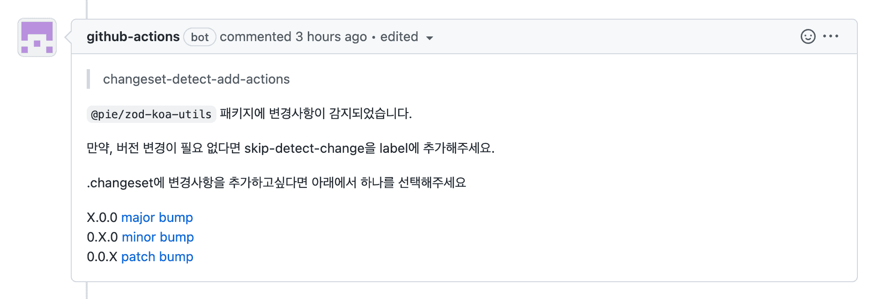

# changesets-detect-add

## 설명

- changeset을 이용한 패키지 배포 플로우를 사용할 때, 해당 PR의 변경점을 파악하여 `.changeset` 하위에 변경된 파일을 기재할 수 있도록 유도하는 action 입니다.

## 사용 방법

- 프로젝트 root의 `.github/workflows` 경로에 아래와 같이 `.yaml` 파일을 작성합니다.

```yaml
# 기호에 맞게 변경해주세요
name: changeset-detect-add
on:
    pull_request:
        branches:
            - '**'
        types: [opened, reopened, labeled, unlabeled, synchronize]

jobs:
    detectAdd:
        runs-on: ubuntu-latest
        steps:
            - uses: actions/checkout@v3
              with:
                  ref: ${{ github.head_ref }}
            - uses: NaverPayDev/@naverpay/changeset-actions/detect-add@main
              with:
                  github_token: ${{ secrets.GITHUB_TOKEN }} # 필요하면 user의 PAT을 넣어주세요.
                  skip_branches: main # skip할 브랜치들을 적어주세요. (default : master,main,develop) 
                  skip_label: skip_detect_label # 해당 액션을 skip할 label의 이름을 적어주세요. (default: skip-detect-change) 
                  packages_dir: packages # 변경을 탐지할 패키지들의 폴더명을 추가해주세요. (default: packages,share) 
                  formatting_script: pnpm run markdownlint:fix # 생성되는 md 파일의 formatting이 필요하다면 추가해주세요
```

## 실행 결과


