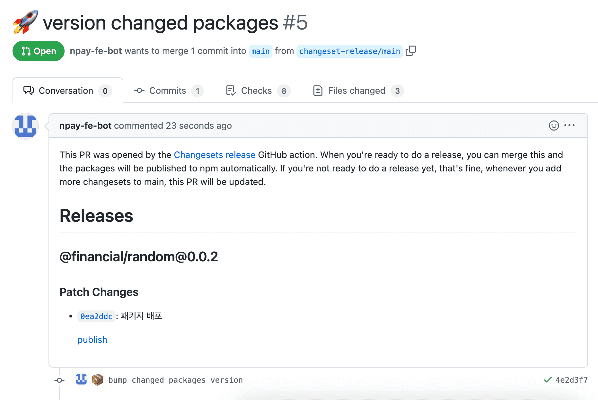
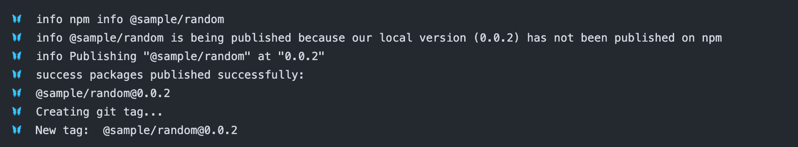
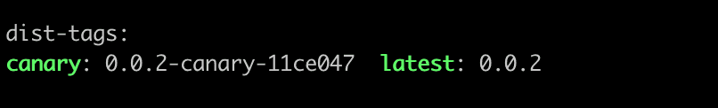

# changesets-publish

## 설명

- changeset을 이용한 패키지 배포 플로우를 사용할 때, 해당 PR의 변경점을 파악하여 `.changeset` 하위에 변경된 패키지들을 배포하는 action 입니다.
- .changeset 하위에 변경사항이 기록된 markdown 있다면 `changeset-release/main` 브랜치를 생성하고 markdown 파일이 없다면 publish 를 수행합니다.

## 사용 방법

- 프로젝트 root의 `.github/workflows` 경로에 아래와 같이 `.yaml` 파일을 작성합니다.

```yaml
# 기호에 맞게 변경해주세요
name: changeset-publish

on:
  push:
    branches:
      - main

concurrency: ${{ github.workflow }}-${{ github.ref }}

jobs:
    detectAdd:
        runs-on: common-fe
        steps:
            - uses: actions/checkout@v3
              with:
                  ref: ${{ github.head_ref }}
            - uses: common-fe/actions/changesets/detect-add@feature/27_publish
              with:
                  github_token: ${{ secrets.GITHUB_TOKEN }} # 필요하면 user의 PAT을 넣어주세요.
                  npm_token: ${{ secrets.NPM_TOKEN }} # npm 배포시 필요한 publish token 을 넣어주세요 
                  publish_script: pnpm run deploy # 배포 실행 script 를 넣어주세요
                  git_username: npay-fe-bot # 버전업 pr 생성시 설정할 github username 을 넣어주세요
                  git_email: npay.fe.bot@navercorp.com # 버전업 pr 생성시 설정할 github email 을 넣어주세요
                  pr_title: 🚀 version changed packages # 버전업 pr 생성시 설정할 pr 타이틀 넣어주세요
                  commit_message: 📦 bump changed packages version # 버전업 pr 생성시 설정할 commit 메시지를 넣어주세요
                  create_github_release_tag: true # release tag 생성여부를 넣어주세요
```

## 실행 결과






