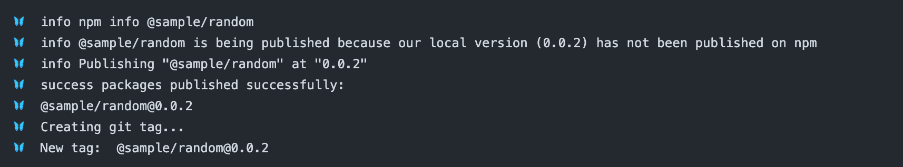

# changesets-publish

## 설명

- changeset을 이용한 패키지 배포 플로우를 사용할 때, 해당 PR의 변경점을 파악하여 `.changeset` 하위에 변경된 패키지들을 배포하는 action 입니다.
- .changeset 하위에 변경사항이 기록된 markdown 있다면 `changeset-release/main` 브랜치를 생성하고 markdown 파일이 없다면 publish 를 수행합니다.

## 사용 방법

- 프로젝트 root의 `.github/workflows` 경로에 아래와 같이 `.yaml` 파일을 작성합니다.

```yaml
# 기호에 맞게 변경해주세요
name: changeset-publish

on:
  push:
    branches:
      - main

concurrency: ${{ github.workflow }}-${{ github.ref }}

jobs:
    detectAdd:
        runs-on: ubuntu-latest
        steps:
            - uses: actions/checkout@v3
              with:
                  ref: ${{ github.head_ref }}
            - uses: NaverPayDev/changeset-actions/publish@main
              with:
                  github_token: ${{ secrets.GITHUB_TOKEN }} # 필요하면 user의 PAT을 넣어주세요.
                  publish_script: pnpm run deploy # 배포 실행 script 를 넣어주세요
                  git_username: npay-fe-bot # 버전업 pr 생성시 설정할 github username 을 넣어주세요
                  git_email: npay.fe.bot@navercorp.com # 버전업 pr 생성시 설정할 github email 을 넣어주세요
                  pr_title: 🚀 version changed packages # 버전업 pr 생성시 설정할 pr 타이틀 넣어주세요
                  commit_message: 📦 bump changed packages version # 버전업 pr 생성시 설정할 commit 메시지를 넣어주세요
                  create_github_release_tag: true # release tag 생성여부를 넣어주세요
                  formatting_script: pnpm run markdownlint:fix # 생성되는 md 파일의 formatting이 필요하다면 추가해주세요
                  provenance: true # (선택) provenance 생성 활성화 (npm CLI 11.5.1+ 필요)
```

## NPM OIDC 신뢰할 수 있는 게시

이 액션은 NPM의 OIDC 기반 신뢰할 수 있는 게시를 사용합니다. NPM 토큰을 시크릿으로 저장할 필요가 없으며, 워크플로우별 단기 자격 증명을 사용하여 더 나은 보안을 제공합니다.

### 사전 요구사항

1. **NPM CLI 버전**: npm CLI v11.5.1 이상 필요
2. **GitHub Actions 러너**: GitHub 호스트 러너 사용 필수
3. **NPM 패키지 설정**: npmjs.com에서 신뢰할 수 있는 게시자 설정 필요

### 설정 방법

1. **npmjs.com에서 신뢰할 수 있는 게시자 설정**:
   - npmjs.com에서 패키지 설정으로 이동
   - "Publishing access" → "Trusted publishers"로 이동
   - 다음 정보로 새 신뢰할 수 있는 게시자 추가:
     - Organization/User: GitHub 조직 또는 사용자 이름
     - Repository: 저장소 이름
     - Workflow filename: 워크플로우 파일 이름 (예: `publish.yml`)
     - Environment name: (선택) GitHub 환경을 사용하는 경우

2. **워크플로우 업데이트**:
   - `id-token: write` 권한 추가
   - `npm_token` 입력 제거 (또는 비워두기)
   - npm CLI 버전이 11.5.1+ 인지 확인

OIDC를 사용하는 워크플로우 예시:

```yaml
name: changeset-publish

on:
  push:
    branches:
      - main

permissions:
    id-token: write      # OIDC에 필수
    contents: write      # 릴리즈 생성에 필수
    pull-requests: write # PR 생성에 필수

concurrency: ${{ github.workflow }}-${{ github.ref }}

jobs:
    detectAdd:
        runs-on: ubuntu-latest
        steps:
            - uses: actions/checkout@v3
              with:
                  ref: ${{ github.head_ref }}

            - name: Setup Node with latest npm
              uses: actions/setup-node@v4
              with:
                node-version: '20'
                registry-url: 'https://registry.npmjs.org'

            - uses: NaverPayDev/changeset-actions/publish@main
              with:
                  github_token: ${{ secrets.GITHUB_TOKEN }}
                  publish_script: pnpm run deploy
                  git_username: npay-fe-bot
                  git_email: npay.fe.bot@navercorp.com
                  pr_title: 🚀 version changed packages
                  commit_message: 📦 bump changed packages version
                  create_github_release_tag: true
                  provenance: true
```

### OIDC의 장점

- NPM 토큰을 생성, 저장, 갱신할 필요 없음
- 자동 provenance 증명
- 토큰 유출 위험 감소
- 더 나은 감사 추적

## 실행 결과





