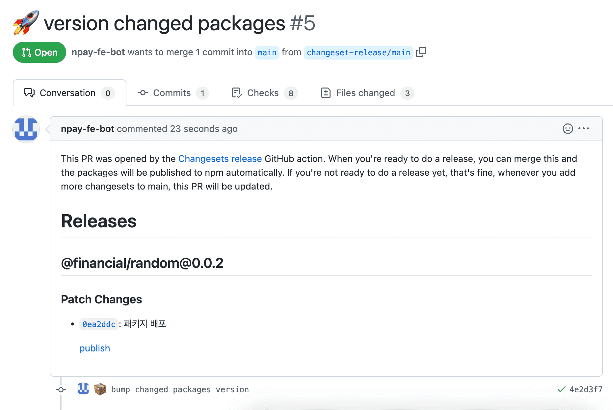
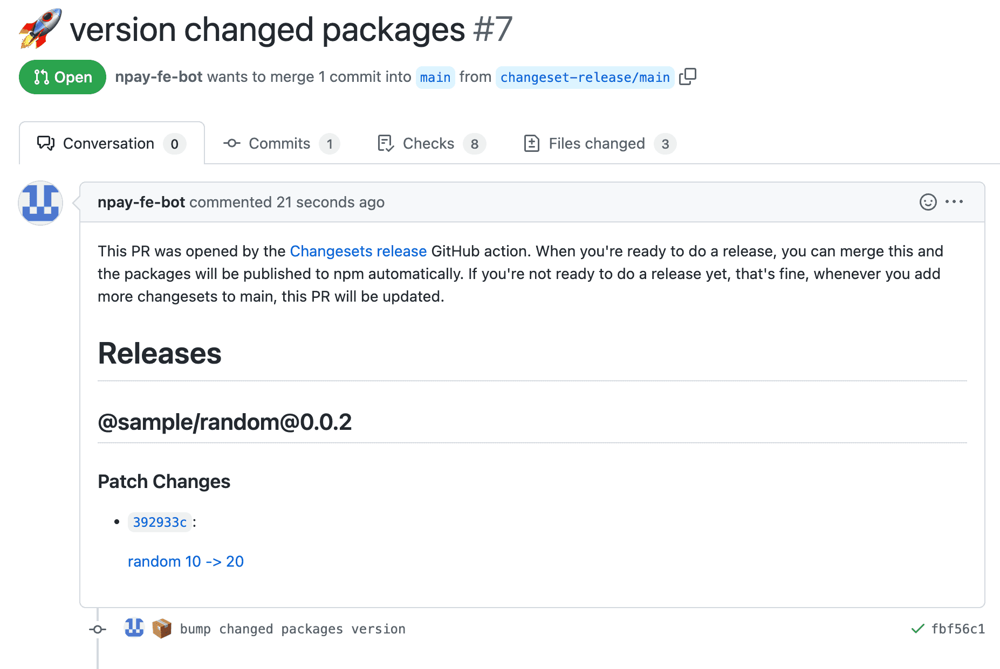
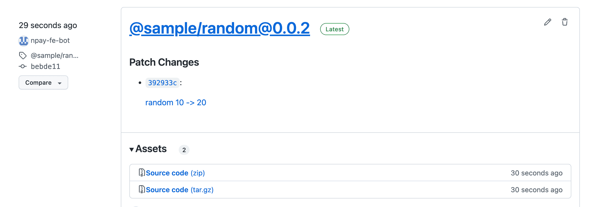

# changesets-publish

## Description

This action identifies changes in a pull request and deploys modified packages under the `.changeset` directory when using a changeset-based package deployment flow. If there are markdown files recording changes under `.changeset`, it creates a `changeset-release/main` branch. If no markdown files are present, it performs the publish operation.

## Usage

Create a `.yaml` file in the `.github/workflows` directory at the root of your project as shown below:

```yaml
# Adjust according to your needs
name: changeset-publish

on:
  push:
    branches:
      - main

concurrency: ${{ github.workflow }}-${{ github.ref }}

jobs:
    detectAdd:
        runs-on: ubuntu-latest
        steps:
            - uses: actions/checkout@v3
              with:
                  ref: ${{ github.head_ref }}
            - uses: NaverPayDev/changeset-actions/actions/publish@main
              with:
                  github_token: ${{ secrets.GITHUB_TOKEN }} # Add user PAT if necessary
                  npm_token: ${{ secrets.NPM_TOKEN }} # (Optional) Token required for npm publishing. Not required if using OIDC.
                  publish_script: pnpm run deploy # Script to execute the deployment
                  git_username: npay-fe-bot # GitHub username for version bump PR creation
                  git_email: npay.fe.bot@navercorp.com # GitHub email for version bump PR creation
                  pr_title: 🚀 version changed packages # PR title for version bump
                  commit_message: 📦 bump changed packages version # Commit message for version bump
                  create_github_release_tag: true # Whether to create a release tag
                  formatting_script: pnpm run markdownlint:fix # Add if formatting the generated markdown files is required
                  provenance: true # (Optional) Enable provenance statements (requires npm CLI 11.5.1+)
```

## Using NPM OIDC Trusted Publishing (Recommended)

NPM now supports OIDC-based trusted publishing, which eliminates the need for storing NPM tokens as secrets. This provides better security by using short-lived, workflow-specific credentials.

### Prerequisites

1. **NPM CLI Version**: Requires npm CLI v11.5.1 or later
2. **GitHub Actions Runner**: Must use GitHub-hosted runners
3. **NPM Package Configuration**: Configure trusted publishers on npmjs.com

### Setup Steps

1. **Configure Trusted Publisher on npmjs.com**:
   - Go to your package settings on npmjs.com
   - Navigate to "Publishing access" → "Trusted publishers"
   - Add a new trusted publisher with:
     - Organization/User: Your GitHub organization or username
     - Repository: Your repository name
     - Workflow filename: Your workflow file name (e.g., `publish.yml`)
     - Environment name: (Optional) If using GitHub environments

2. **Update your workflow**:
   - Add `id-token: write` permission
   - Remove `npm_token` input (or leave it empty)
   - Ensure npm CLI version is 11.5.1+

Example workflow with OIDC:

```yaml
name: changeset-publish

on:
  push:
    branches:
      - main

permissions:
    id-token: write      # Required for OIDC
    contents: write      # Required for creating releases
    pull-requests: write # Required for PR creation

concurrency: ${{ github.workflow }}-${{ github.ref }}

jobs:
    detectAdd:
        runs-on: ubuntu-latest
        steps:
            - uses: actions/checkout@v3
              with:
                  ref: ${{ github.head_ref }}

            - name: Setup Node with latest npm
              uses: actions/setup-node@v4
              with:
                node-version: '20'
                registry-url: 'https://registry.npmjs.org'

            - uses: NaverPayDev/changeset-actions/actions/publish@main
              with:
                  github_token: ${{ secrets.GITHUB_TOKEN }}
                  # npm_token is not required when using OIDC
                  publish_script: pnpm run deploy
                  git_username: npay-fe-bot
                  git_email: npay.fe.bot@navercorp.com
                  pr_title: 🚀 version changed packages
                  commit_message: 📦 bump changed packages version
                  create_github_release_tag: true
                  provenance: true
```

### Benefits of OIDC

- No need to create, store, or rotate NPM tokens
- Automatic provenance attestations
- Reduced risk of token exfiltration
- Better audit trail

## Execution Results






